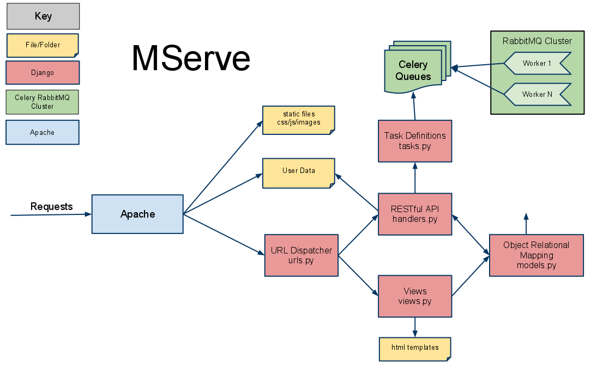

MServe Architecture
###################

Welcome to the MServe documentation

Introduction
**************

**MServe is a RESTFul Web Framework for Service Providers.
Its purpose is to provide human and machine usable interfaces to control the ingest, access, processing and manipulation of content using compute resources.**

The Service Provider can define sets of tasks to run at the following times

* Ingest - When content is uploaded into MServe
* Access - When content is requested from MServe
* Update - When content is changed in MServe
* Periodic - At specified times
* Manual - At the request of the consumer or workflow engine

Tasks
**************

Tasks that can be run include (but not limited)

* Checksum Verification
* Archive and Backup
* Mime type detection
* Thumbnail generation
* Video Proxy Generation
* Video Meta data extraction
* Archive Retrieval
* Other batch process or web service

Other tasks can be created easily and added to MServe, see :ref:`task-reference-label`.

Interfaces
**************

There are 3 main interfaces in MServe

* HTML interface  for human manipulation of the content
* HTTP/RESTful interface for machine workflows and automated systems
* WEBDAV interface to provide file system access to the content

Security
**************
Resources in MServe all have a long unguessable key which is used for access, sub keys can be generated and given to third party's or workflow engines to allow a subset of actions to be done. For example a Read-Only key can be generated for a piece of content that is an image allowing another user to view the image but not update it. All traffic in MServe needs go via HTTPS if using MServe over an insecure network

Users
*******

Users can log-in via

* Open-ID
* Using a standard user name password.

Usage
*******

Each task produces usage which are reported against abstract metrics, some examples are::

    http://mserve/disc_space - the amount of disk space used
    http://mserve/ingest - the amount of bytes ingested
    http://mserve/access - the amount of bytes accessed

Other application specific metrics can be created and recorded

Service Provider can query theses metrics aggregated over all services to see resource usage. Consumers can query these metrics to see their individual usage

Design Overview
###################

Software Components
*******************

MServe is fronted with Lighttpd or Apache2, both of which efficient access to static files, and bandwidth control to content. It proxys using fast cgi to Django. Django defines the model for resources, content and their usage. Django handles requests for access ingest and manipulation of the content. For batch process Django uses Celery which holds queues of tasks to be processed. The queue is process by an efficient messaging service RabbitMQ.

An Example Workflow
*******************

An Service Provider creates a Container, and creates a Service within it. The Service Provider gives access to the service to the Customer. The Customer uploads content and the Service creates Mfile(s).The Customer creates Jobs which act on Mfiles to create Job Outputs. The Customer can create new Mfiles from JobOutputs. The Customer can view Usage of compute resources on any of the Mfiles/Jobs/JobOutputs or an aggregation of the usage as a whole on the Service. The Service Provider can view usage of the whole system by looking at the usage for the container, or of an individual service. The administrator can take management actions on the service to control usage.

.. _task-reference-label:

Defining Tasks
**************

Firstly decide what we want to do with data. When i upload any data i want

* An md5 checksum of the file calulated
* The mimetype of the file is recorded

in addition when i upload an image i want the following tasks to be executed

* A thumbnail of the image generated

Also i want to

* Periodically pull twitter updates about a topic, say 7:30 every morning

So let's define those tasks (http://ask.github.com/celery/userguide/tasks.html)::

    from celery.decorators import task
    from celery.task import periodic_task

    @task
    def mimefile(file):
        mimedetector = magic.open(magic.MAGIC_MIME)
        mimetype = mimedetector.file(file)
        return {"message":"Mimetype successful","mimetype":mimetype}

    @task
    def md5(file):
        md5 = hashlib.md5(file)
        return {"message":"MD5 successful","md5":md5}

    @task
    def thumbnail(image,output):
        height = 210
        width  = 120
        im.thumbnail((width,height))
        im.save(output)
        return {"Thumbnail successful"}

    @periodic_task(run_every=crontab(hours=7, minute=30))
    def twitter_topic(topic):
        result = ... Some twitter stuff goes here
        return {"message":"Twitter successful","result":result}

How to submit tasks
*******************

At some point after the user has uploaded a file, we use task.delay() to submit the task asynchronously using celery via rabbitmq. We pass this id back the client so the status of the task can be queried, thus giving a responsive feel to the UI::

    def process_file(uploaded_file)
        tasks = []
        task1 = mimefile.delay(uploaded_file)
        task2 = md5.delay(uploaded_file)
        tasks.push(task1)
        tasks.push(task2)
        if is_image(uploaded_file)
                task3 = thumbnail(uploaded_file,someoutputfile)
                tasks.push(task3)
        # These asynchronous tasks return an id :
        return tasks

Then at some point in the future when the user asks for the status we check on the task::

    def get_task_state(id)
        return AsyncResult(id)

Processing Tasks
****************

In a simple setup we declare 2 queues, a normal queue and a high proirity queue (http://ask.github.com/celery/userguide/routing.html)::

    # Details of our rabbitMQ broker
    BROKER_HOST = "localhost"
    BROKER_PORT = 5672
    BROKER_USER = "myuser"
    BROKER_PASSWORD = "mypassword"
    BROKER_VHOST = "myvhost"

    # Details of our Queues
    CELERY_DEFAULT_QUEUE = "normal_tasks"
    CELERY_QUEUES = {
        "normal_tasks": {
                "binding_key": "normal.#",
        },
        "priority_tasks": {
                "binding_key": "priority.#",
        },
    }

By default the queues go to the queue named 'normal_tasks' but at runtime we can override this::

    def process_priority_file(uploaded_file)
        task = thumbnail.delay(uploaded_file,{"routing_key":"priority.task"})

This forces the task onto the 'priority_tasks' queue, Next we start celery processing tasks from these queues. If we have a machine node1 then::

    node1:> manage.py celeryd_multi start -n:1 normal -n:2 priority -Q:1 normal_tasks -Q:2 priority_tasks -c 5

This starts two worker nodes (normal and priority) bound to (normal_tasks, priority_tasks) respectively, each node has 5 concurrent processes taking messages from the queues,this can be configured appropriate to the number of cores on the machine. If in the future we need to scale out to more nodes we can start more worker nodes on another machine, node2::

    node2:> manage.py celeryd_multi start -n normal -Q:1 normal_tasks -c 4

In a more complicated setup we may have a dedicated peice of hardware, for which we can declare its own queue::

    CELERY_QUEUES += {
        "hardware_tasks": {
                "binding_key": "hardware.#",
        },
    }

The on the machine with the hardware we declare a single concurrency worker node::

    node3:> manage.py celeryd_multi start -n hardware -Q:1 hardware_tasks -c 1
