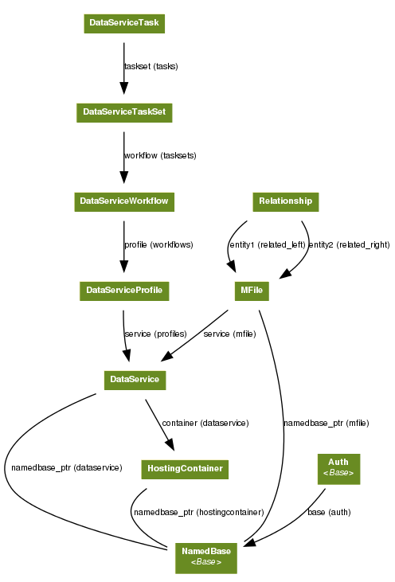
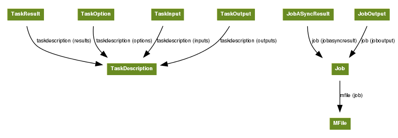

#################################
MServe Development Guide
#################################

------------------------
Introduction
------------------------

DataService Models
--------------------

.. automodule:: dataservice.models

Base class
+++++++++++

.. autoclass:: dataservice.models.Base
    :noindex:
    
NamedBase class
+++++++++++++++++

.. autoclass:: dataservice.models.NamedBase
    :noindex:

::

  # Get a NamedBase from the database
  from dataservice.models import NamedBase
  base = NamedBase.object.get(id="baseid")
  
Hosting Container class
++++++++++++++++++++++++

.. autoclass:: dataservice.models.HostingContainer
    :noindex:

::

  # Create a new HostingContainer
  from dataservice.models import HostingContainer
  hostingcontainer = HostingContainer.create_container("New Container")

DataService class
++++++++++++++++++++++++

.. autoclass:: dataservice.models.DataService
    :noindex:

::

  # Create a new DataService
  from dataservice.models import HostingContainer

  # Either Create a new HostingContainer
  hostingcontainer = HostingContainer.create_container("New Container")

  # Or get an existing HostingContainer from the database
  hostingcontainer = HostingContainer.objects.get(id="hostingcontainerid")
  dataservice = hostingcontainer.create_data_service("New DataService")
  

MFile class
++++++++++++++++++++++++

.. autoclass:: dataservice.models.MFile
  :noindex:

::

  # Create a new MFile
  from dataservice.models import DataService

  # First get an existing DataService from the database
  dataservice = DataService.objects.get(id="dataserviceid")

  # Create an Empty Mfile
  mfile = dataservice.create_mfile("New MFile")

  # Or, Create an MFile from some data
  from django.core.files.base import ContentFile
  mfile = dataservice.create_mfile("New MFile", file=ContentFile("some content for the file"))

  # Or, Create an MFile from a file in the POST of a django request object
  mfile = dataservice.create_mfile("New MFile", file=request.POST['fileparam'])

See Django `Request <https://docs.djangoproject.com/en/dev/ref/request-response/>`_ object

Querying
^^^^^^^^^^^^^^

::

  from dataservice.models import MFile

  # Get all MFiles
  mfiles = MFile.objects.all()

  # Get MFiles at a service
  mfiles = MFile.objects.filter(service=somedataservice)
  #or
  mfiles = somedataservice.mfiles_set.all()

  # Search by exact name
  mfiles = MFile.objects.filter(name=="myfile")

  # Search by partial name
  mfiles = MFile.objects.filter(name__contains=="myfile")

  # Search by folder
  mfiles = MFile.objects.filter(folder==somefolder)

  # Search by size
  mfiles = MFile.objects.filter(size__gt==1024)

  # Chaining searches
  mfiles = MFile.objects.filter(folder==somefolder).exclude(name=="myfile")

MFolder class
++++++++++++++++++++++++

.. autoclass:: dataservice.models.MFolder
    :noindex:
    
::

  # Create a new MFolder
  from dataservice.models import DataService

  # First get an existing DataService from the database
  dataservice = DataService.objects.get(id="dataserviceid")

  # Create an MFolder at the root of the service
  mfolder1 = dataservice.create_mfolder("folder1")

  # Create a sub MFolder
  submfolder2 = dataservice.create_mfolder("subfolder1", parent=mfolder1)

  # Create an MFile in a folder
  mfile = dataservice.create_mfile("New MFile", folder=submfolder)

Auth class
++++++++++++++++++++++++

.. autoclass:: dataservice.models.Auth
    :noindex:

DataService Object Model Graph
++++++++++++++++++++++++++++++

JobService Models
--------------------

.. automodule:: jobservice.models

.. autoclass:: jobservice.models.TaskDescription
  :noindex:

.. autoclass:: jobservice.models.TaskInput
  :noindex:

.. autoclass:: jobservice.models.TaskOutput
  :noindex:

.. autoclass:: jobservice.models.TaskResult
  :noindex:

.. autoclass:: jobservice.models.Job
  :noindex:

JobService Object Model Graph
++++++++++++++++++++++++++++++

URLS
----------

TODO: info on urls

Handlers
----------

.. automodule:: dataservice.handlers

.. automodule:: jobservice.handlers

------------------------
Development Environment
------------------------

Assuming you have downloaded the MServe source and extracted into a directory named **mserve**. First install the mserve dependencies::
  
  sudo mserve/scripts/setup-mserve.sh dependencies

Copy the **mserve/scripts/settings_dev.py** file into **mserve/django-mserve/**
  
Edit the **settings_dev.py**

* Set the **MSERVE_HOME** parameter to the directory that the settings.py file is located (DEFAULT=os.getcwd())
* Set the **MSERVE_DATA** to where you want to store MServe files (DEFAULT=/path/to/mserve-test-data)
* Set the **MSERVE_LOG** to the directory where you want to save the development log file (DEFAULT=os.getcwd())
* Set the **DBNAME** to the name of the developement database (DEFAULT=mservedbdev)

Setup the database::

  python mserve/django-mserve/manage.py syncdb
  python mserve/django-mserve/manage.py migrate dataservice
  python mserve/django-mserve/manage.py migrate jobservice
  python mserve/django-mserve/manage.py migrate celery

Run the development service::

  python mserve/django-mserve/manage.py runserver

Visit `127.0.0.1:8000 <http://127.0.0.1:8000>`_ in your browser, output will be to the console window

Testing
------------------

There are 3 classes of tests in MServe *django-mserve/dataservice/tests.py*

**ClientTest**
    The Client Tests uses django test client
    `Django Test Client <https://docs.djangoproject.com/en/dev/topics/testing/#module-django.test.client>`_
    It mimics a MServe API user and browser, and its primary function is to test the code in *django-mserve/dataservice/handlers.py* and *django-mserve/dataservice/urls.py*

**ApiTest**
    The Api tests check the internal MServe API, functionality *django-mserve/dataservice/models.py*

**TaskTest**
    This set of tests is to test the running of tasks *django-mserve/dataservice/tasks.py*
    There should be a test for each individual task, and a new test should be added when creating a new task

Test can be run with the command::

  python mserve/django-mserve/manage.py test dataservice

Installing MServe
------------------

MServe has been tested on Ubuntu 10.04-3 LTS, other versions may work but have not been tested

On a fresh 10.04-3 Ubuntu, update and reboot::

  sudo apt-get update
  sudo apt-get -y upgrade
  sudo reboot

Then follow the commands::

  cp mserve/scripts/setup-mserve.sh ~
  cd ~
  ./setup-mserve.sh -a mserve.tar.gz

------------------
Debugging MServe
------------------

Django Shell
------------------

`Django Shell Documentation <https://docs.djangoproject.com/en/dev/ref/django-admin/#shell/>`_

Running the Django Shell::

  python mserve/django-mserve/manage.py shell

Finding an MFile::

  > from dataservice.models import *
  > MFile.objects.filter(id="someid")

Running a task synchronously::

  > from dataservice.tasks import *
  > mimefile([mfileid],[])
  { "mimetype" : "XXXXX" }
  
Running a task asynchronously::

  > from dataservice.tasks import *
  > asyncresult = mimefile.delay([mfileid],[])
  .... wait a second ....
  > asyncresult.result
  { "mimetype" : "XXXXX" }

Where to look for errors
---------------------------

Logs
-------

Development::

  MSERVE_HOME/mserve.log
  MSERVE_HOME/celery{n}.log (where n is the number of the queue)

Live Server::

  /var/log/mserve/mserve.log
  /var/log/mserve/celeryd{n}.log (where n is the number of the queue)
  /var/log/apache/access.log
  /var/log/apache/error.log

Tests not running
++++++++++++++++++

Tasks not submitted
+++++++++++++++++++

Tasks submitted but not running
+++++++++++++++++++++++++++++++++