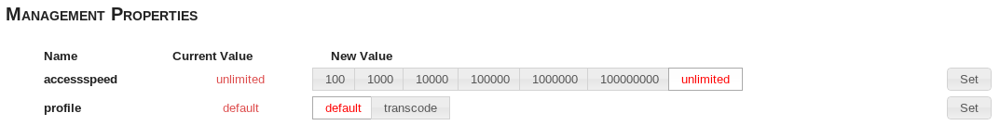
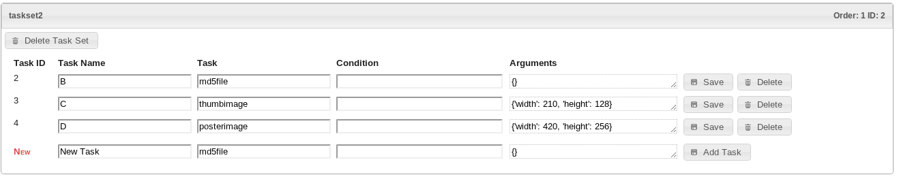

MServe Service Provider Guide
##############################

Welcome to the MServe Service Provider Guide

Gaining Admin access to a  Service
**********************************

There is only one way in which you can be given access to an MServe Service.

* Directly given an URL by a administrator provider

   http(s)://<hostname.fully-qualified>/browse/<unique-capability-id>/

Configuring a Service
**********************

Properties
-----------

The **start** and **end** time of the service is displayed here (currently not editable)

The **priority** of the service is display here; this controls what queue the tasks for this service are assigned to, either **High** or **Low**

Webdav Access
--------------

This is the `WebDAV <http://en.wikipedia.org/wiki/WebDAV>`_ url for accessing the service over the *dav* protocol. WebDAV allow file system access to content stored in MServe, and manipulation of the folder structure

WebDAV can be mounted using the following command (davfs2 on Ubuntu)::

   sudo mount -t davfs http(s)://<hostname.fullyqualified>/webdav/<unique-capability-id>/ davmnt -o uid=<user>,gid=<group>

Management Properties
----------------------

These properties further control how the service operates.

**Access Speed** determines the download speed of files accessed through this service.

**Profile** determines the set of tasks that run on ingest, access, update and periodic tasks. (these can be edited below)

Profile Configuration
----------------------

The Profile Config displays the **Task Sets** that are run in each profile. Currently there are 2 profiles **default** and **transcode**. In the future it will be possible to add profiles from this interface.

Clicking on a profile display the ingest, access, update and periodic task sets associated with that profile.

""""""""""""""
Task Sets
""""""""""""""

Task sets are groups of task that are executed in parallel, the next task set is not started until all tasks in the previous task set have completed

Task sets can be added by clicking 'Add Task Set', and can be deleted by clicking 'Delete Task Set'

"""""""
Tasks
"""""""

Tasks can be added by using the form under each task set, tasks set are run in order that they appear in the interface

Tasks require the following information

* Task Name - A descriptive name for the Task, ie. "Thumbnail images"
* Task - The name of the task to run - e.g. "thumb_image"
* Condition - A precondition for the task, which if evaluated to True or left blank lets the task run.
* Argument - A set of json encoded arguments passed to the task at execution

Tasks can be deleted by clicking 'Delete'

Tasks can be edited and then saved by clicking 'Save'

The execution order of the task sets can be manipulated by dragging the task set up/down the order. After the order has been changed click **Save Order**

**Currently Periodic tasks will not be run if added through this interface.**
