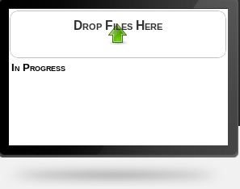
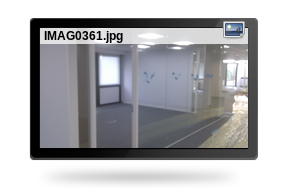
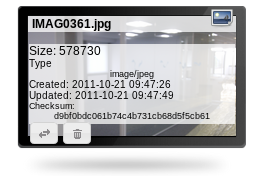
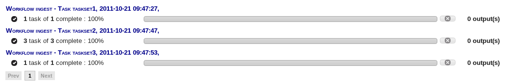
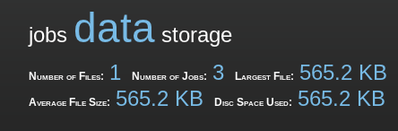
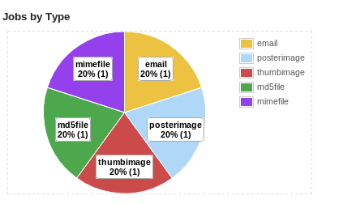

MServe User Guide
###################

Welcome to the MServe User Guide

Accessing a Service
*******************

There are two ways in which you can be given access to an MServe Service.

* Directly given an URL by a service provider - this allows the use of a service without a login
* If you have a login to MServe you can request a service from the home page. Access to the service will appear on your home page if approved by the service provider.

A service url will have the following format::

   http(s)://<hostname.fullyqualified>/browse/<unique-capability-id>/

Using a Service
***************

Point your browser at the service URL, or login to MServe and choose the service you wish to access from the list of services.

Files
======

You can view these files by clicking on the **Files** tab, this is also the default page for a service.

If the service is new there will be no files displayed on the page. In order to upload files either drag file to the "Drop Files here".

Or you can click on the "Drop Files here" to open a file browser.

Once you have uploaded a file it should appear in the page below (if you hover over the new file you can browse

On the left hand side a tree structure shows a file system file of the service.

Jobs
=====

When a file is uploaded a number of jobs are started. You can view these jobs by clicking on the **Jobs** tab of a service page.

Each job has an overview displayed which shows the job name, the number of subtasks and the percentage complete.

Clicking on a job displays details of the subtasks including success/failure of the job and the results of any output.

Access Control
==============

Currently there is no way to manipulate the access control of a service. In the future you should be able to delegate access to 3rd parties.

Usage
=====

As files are ingested, and jobs are run, usage reports are produced about different metrics.

Metrics are defined by the service provider but can include such things as: files ingested, disc space used, job runtime...

A summary of some of these metrics appear at the top of a service page

For a more detailed view of usage, click on the **Usage** tab

Currently, there are timeline graphs showing subtasks in the last 24hours, and subtasks in the last 1 hour.

A break down of jobs by type shows pie charts with the success/failure rate of each jobs type, as well as an overall view of the amount of different jobs run.

Below this is athe raw output of all usage recorded by the service.